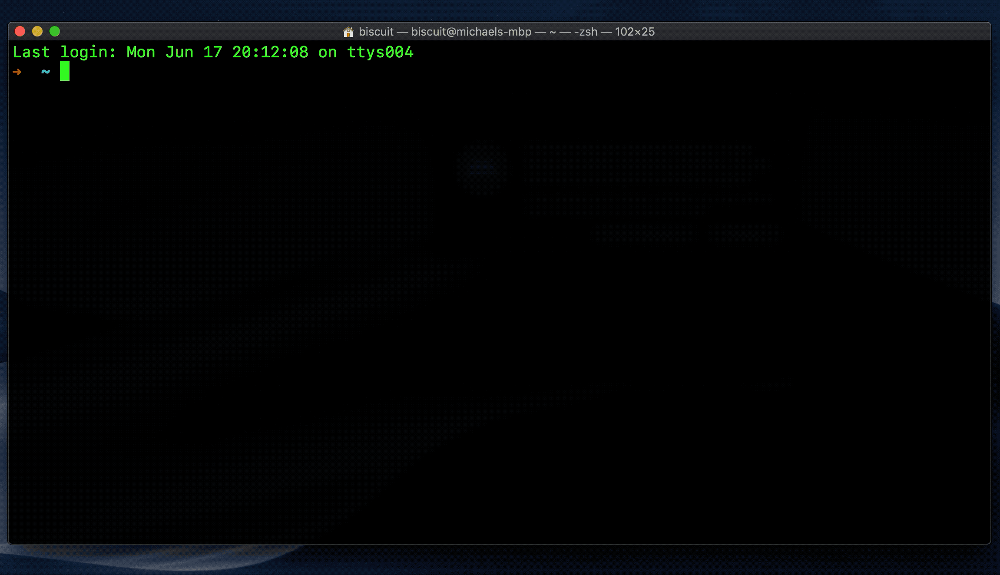

PAM WatchID
-----------
A PAM plugin for authenticating using the new kLAPolicyDeviceOwnerAuthenticationWithBiometricsOrWatch API in macOS 10.15, written in Swift.
Fork of a fork of a fork from code originally by [Reflejo](https://github.com/Reflejo), but updated to support M1s, as well as modern macOS versions (Big Sur+, tested up to Ventura Beta).

Installation
------------

1. `$ sudo make install`
2. Edit `/etc/pam.d/sudo` to include as the first line: `auth sufficient pam_watchid.so "reason=execute a command as root"`

_Note that you might have other `auth`, don't remove them._
